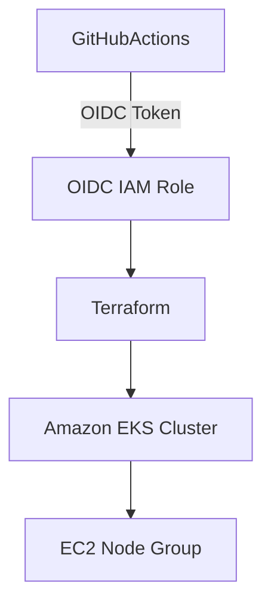

# 🚜 Caterpillar EKS Lab – AWS Terraform Portfolio Project  
This project demonstrates how to provision a production-ready **Amazon EKS (Elastic Kubernetes Service)** cluster using **Terraform**, with **OIDC integration for GitHub Actions**, and AWS IAM roles and networking fully automated.  
> 🔧 Designed as part of a technical interview for an IT Architect role at Caterpillar.  
  
## 🌟 Features  
- 🧠 Infrastructure-as-Code using Terraform  
- ☁️ EKS Cluster with node groups across multiple AZs  
- 🔐 GitHub Actions + OIDC + IAM Role for secure deployments  
- 🌐 Public subnets with auto-assigned IPs  
- 📦 Modular, reusable configuration  
- ✅ Screenshots included for visual verification  
  
## 🏗️ Architecture Overview  

  
## 📁 Project Structure  
```bash  
caterpillar-eks-lab/  
├── terraform/  
│   ├── main.tf                 # Main Terraform config  
│   ├── github-oidc.tf          # GitHub OIDC provider & IAM role  
│   └── terraform.tfstate       # Terraform state file  
├── LICENSE                     # MIT License  
├── README.md                   # This file  
```  
  
## 🚀 How to Deploy  
1. ✅ **Clone the Repo**  
```bash  
git clone https://github.com/RedLeopard/caterpillar-eks-lab.git  
cd caterpillar-eks-lab/terraform  
```  
  
2. 🔑 **Set up AWS credentials**  
Export your AWS access keys or use a named profile.  
  
3. ⚙️ **Initialize Terraform**  
```bash  
terraform init  
```  
  
4. 📐 **Review Plan**  
```bash  
terraform plan  
```  
  
5. 🚀 **Apply the Infrastructure**  
```bash  
terraform apply  
```  
  
6. ⛅ **Access the Cluster**  
```bash  
aws eks update-kubeconfig --name caterpillar-eks-cluster  
kubectl get nodes  
```  
  
## 📸 Visual Evidence  
  
### ✅ EKS Cluster in Console  
  
  
### ✅ EC2 Node Instances 
  
  
### ✅ Security Group Details  
  
  
## 📦 Coming Soon  
- 🔄 GitHub Actions-based CI/CD pipeline  
- 📈 Auto-scaling with Karpenter  
- 📊 Prometheus + Grafana monitoring dashboards  
  
## 📜 License  
MIT License. Feel free to use, improve, or fork this project.  
  
## 🔗 Built With Pride  
Created with ❤️ by **Edward Thornton**  
_For the Caterpillar IT Architect Interview_  
[GitHub Profile](https://github.com/RedLeopard) • [Portfolio](https://hireedwardthornton.click)  
