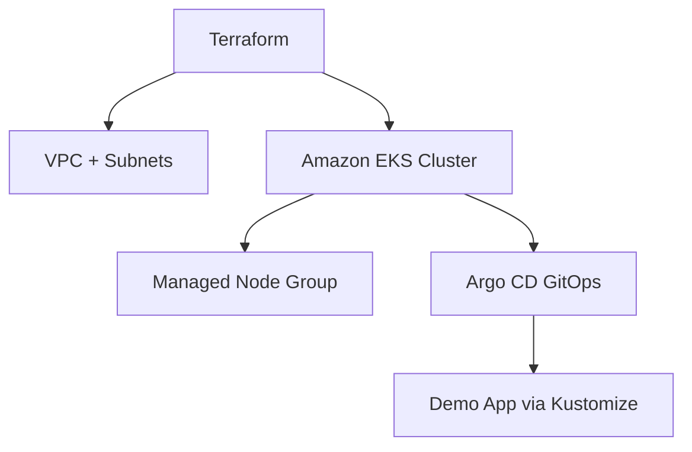

# 🌐 Project Spectrum – Hybrid K8s + GitOps (AWS Terraform Portfolio Project)
This project provisions a **production-ready Amazon EKS cluster** with **Terraform**, adds **Argo CD GitOps** for app delivery, and enables **IRSA** for least-privileged IAM to workloads.  
> 🚀 Built as preparation for the **Principal Engineer I – Multi Cloud Infrastructure** role at Spectrum (Charter Communications).
  
## 🌟 Features  
- 🧩 Infrastructure-as-Code with Terraform  
- ☸️ Amazon EKS (1.29) with managed node groups across multiple AZs  
- 🔐 IRSA (IAM Roles for Service Accounts) enabled  
- ⚙️ Argo CD GitOps for automated sync & drift detection  
- 🌐 API endpoint CIDR controls (public for dev, restrict later)  
- 💰 FinOps-aware (Spot nodes, easy add for Budgets/Anomaly)  
- 🧰 Modular layout ready for CI, Ansible, and MLOps add-ons   
  
## 🏗️ Architecture Overview  

  
## 📁 Project Structure  
```bash  
project-spectrum/
├── infra/                    # Terraform EKS + VPC configs
│   ├── providers.tf
│   ├── variables.tf
│   ├── vpc.tf
│   ├── eks.tf
│   └── outputs.tf
├── apps/                     # (GitOps) App manifests
│   └── app-guestbook.yaml
├── docs/                     # Architecture + runbooks + ADRs
│   ├── ARCHITECTURE.md
│   ├── RUNBOOK.md
│   └── ADR-0001-why-gitops.md
├── .github/workflows/        # GitHub Actions CI
│   └── terraform.yml
├── .gitignore
└── README.md
```
 
  
## 🚀 How to Deploy  
1. ✅ **Clone the Repo**  
```bash  
git clone https://github.com/RedLeopard/project-spectrum.git
cd project-spectrum/infra
```  
  
2. 🔑 **Set up AWS credentials**  
aws configure
  
3. ⚙️ **Initialize Terraform**  
```bash  
terraform init  
```  
  
4. 📐 **Review Plan**  
```bash  
terraform plan  
```  
  
5. 🚀 **Apply the Infrastructure**  
```bash  
terraform apply -auto-approve 
```  
  
6. ⛅ **Access the Cluster**  
```bash  
aws eks update-kubeconfig --name project-spectrum --region us-east-2
kubectl get nodes
kubectl get ns 
```

7. 🧭 Install Argo CD
kubectl create ns argocd
helm repo add argo https://argoproj.github.io/argo-helm
helm repo update
helm install argocd argo/argo-cd -n argocd
kubectl -n argocd get pods
  
## 📸 Visual Evidence  
  
### ✅ EKS Cluster in Console  
  
  
### ✅ EC2 Node Instances 
  
  
### ✅ Security Group Details  

  
## 📦 Coming Soon  
- 🔄 GitHub Actions-based CI/CD pipeline for GitOps  
- 📈 Auto-scaling with Karpenter  
- 📊 Prometheus + Grafana monitoring dashboards  
- 🧰 Ansible playbooks for hybrid/on-prem integration  
- 🤖 Simple ML inference service (MLOps demo)  
  
## 📜 License  
MIT License. Feel free to use, improve, or fork this project.  
  
## 🔗 Built With Pride  
Created with ❤️ by **Edward Thornton**  
_For the Spectrum Principal Engineer Interview_  
[GitHub Profile](https://github.com/RedLeopard) • [Portfolio](https://hireedwardthornton.click)
